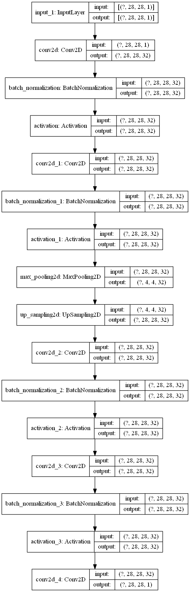

```python
import sys
sys.path.append('E:/pyradox')
```


```python
from tensorflow import keras
import numpy as np
from pyradox import convnets
```


```python
inputs = keras.Input(shape=(28, 28, 1))
x = convnets.GeneralizedSegNet(encoder_config=[(2, 32, 3, 7)])(inputs)
outputs = keras.layers.Convolution2D(1, 1, activation="sigmoid")(x)

model = keras.models.Model(inputs=inputs, outputs=outputs)
```


```python
model.summary()
keras.utils.plot_model(model, show_shapes=True, expand_nested=True)
```

    Model: "model"
    _________________________________________________________________
    Layer (type)                 Output Shape              Param #   
    =================================================================
    input_1 (InputLayer)         [(None, 28, 28, 1)]       0         
    _________________________________________________________________
    conv2d (Conv2D)              (None, 28, 28, 32)        320       
    _________________________________________________________________
    batch_normalization (BatchNo (None, 28, 28, 32)        128       
    _________________________________________________________________
    activation (Activation)      (None, 28, 28, 32)        0         
    _________________________________________________________________
    conv2d_1 (Conv2D)            (None, 28, 28, 32)        9248      
    _________________________________________________________________
    batch_normalization_1 (Batch (None, 28, 28, 32)        128       
    _________________________________________________________________
    activation_1 (Activation)    (None, 28, 28, 32)        0         
    _________________________________________________________________
    max_pooling2d (MaxPooling2D) (None, 4, 4, 32)          0         
    _________________________________________________________________
    up_sampling2d (UpSampling2D) (None, 28, 28, 32)        0         
    _________________________________________________________________
    conv2d_2 (Conv2D)            (None, 28, 28, 32)        9248      
    _________________________________________________________________
    batch_normalization_2 (Batch (None, 28, 28, 32)        128       
    _________________________________________________________________
    activation_2 (Activation)    (None, 28, 28, 32)        0         
    _________________________________________________________________
    conv2d_3 (Conv2D)            (None, 28, 28, 32)        9248      
    _________________________________________________________________
    batch_normalization_3 (Batch (None, 28, 28, 32)        128       
    _________________________________________________________________
    activation_3 (Activation)    (None, 28, 28, 32)        0         
    _________________________________________________________________
    conv2d_4 (Conv2D)            (None, 28, 28, 1)         33        
    =================================================================
    Total params: 28,609
    Trainable params: 28,353
    Non-trainable params: 256
    _________________________________________________________________
    





```python

```
