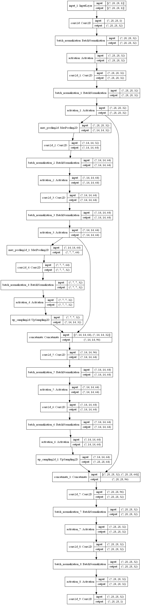

```python
from tensorflow import keras
import numpy as np
from pyradox import convnets
```


```python
inputs = keras.Input(shape=(28, 28, 1))
x = convnets.GeneralizedUNet(
    encoder_config=[(2, 32, 3, 2), (2, 64, 3, 2)], bottleneck_conv=[32, (1, 1)]
)(inputs)
outputs = keras.layers.Convolution2D(1, 1, activation="sigmoid")(x)

model = keras.models.Model(inputs=inputs, outputs=outputs)
```


```python
model.summary()
keras.utils.plot_model(model, show_shapes=True, expand_nested=True)
```

    Model: "model"
    __________________________________________________________________________________________________
    Layer (type)                    Output Shape         Param #     Connected to                     
    ==================================================================================================
    input_1 (InputLayer)            [(None, 28, 28, 1)]  0                                            
    __________________________________________________________________________________________________
    conv2d (Conv2D)                 (None, 28, 28, 32)   320         input_1[0][0]                    
    __________________________________________________________________________________________________
    batch_normalization (BatchNorma (None, 28, 28, 32)   128         conv2d[0][0]                     
    __________________________________________________________________________________________________
    activation (Activation)         (None, 28, 28, 32)   0           batch_normalization[0][0]        
    __________________________________________________________________________________________________
    conv2d_1 (Conv2D)               (None, 28, 28, 32)   9248        activation[0][0]                 
    __________________________________________________________________________________________________
    batch_normalization_1 (BatchNor (None, 28, 28, 32)   128         conv2d_1[0][0]                   
    __________________________________________________________________________________________________
    activation_1 (Activation)       (None, 28, 28, 32)   0           batch_normalization_1[0][0]      
    __________________________________________________________________________________________________
    max_pooling2d (MaxPooling2D)    (None, 14, 14, 32)   0           activation_1[0][0]               
    __________________________________________________________________________________________________
    conv2d_2 (Conv2D)               (None, 14, 14, 64)   18496       max_pooling2d[0][0]              
    __________________________________________________________________________________________________
    batch_normalization_2 (BatchNor (None, 14, 14, 64)   256         conv2d_2[0][0]                   
    __________________________________________________________________________________________________
    activation_2 (Activation)       (None, 14, 14, 64)   0           batch_normalization_2[0][0]      
    __________________________________________________________________________________________________
    conv2d_3 (Conv2D)               (None, 14, 14, 64)   36928       activation_2[0][0]               
    __________________________________________________________________________________________________
    batch_normalization_3 (BatchNor (None, 14, 14, 64)   256         conv2d_3[0][0]                   
    __________________________________________________________________________________________________
    activation_3 (Activation)       (None, 14, 14, 64)   0           batch_normalization_3[0][0]      
    __________________________________________________________________________________________________
    max_pooling2d_1 (MaxPooling2D)  (None, 7, 7, 64)     0           activation_3[0][0]               
    __________________________________________________________________________________________________
    conv2d_4 (Conv2D)               (None, 7, 7, 32)     2080        max_pooling2d_1[0][0]            
    __________________________________________________________________________________________________
    batch_normalization_4 (BatchNor (None, 7, 7, 32)     128         conv2d_4[0][0]                   
    __________________________________________________________________________________________________
    activation_4 (Activation)       (None, 7, 7, 32)     0           batch_normalization_4[0][0]      
    __________________________________________________________________________________________________
    up_sampling2d (UpSampling2D)    (None, 14, 14, 32)   0           activation_4[0][0]               
    __________________________________________________________________________________________________
    concatenate (Concatenate)       (None, 14, 14, 96)   0           activation_3[0][0]               
                                                                     up_sampling2d[0][0]              
    __________________________________________________________________________________________________
    conv2d_5 (Conv2D)               (None, 14, 14, 64)   55360       concatenate[0][0]                
    __________________________________________________________________________________________________
    batch_normalization_5 (BatchNor (None, 14, 14, 64)   256         conv2d_5[0][0]                   
    __________________________________________________________________________________________________
    activation_5 (Activation)       (None, 14, 14, 64)   0           batch_normalization_5[0][0]      
    __________________________________________________________________________________________________
    conv2d_6 (Conv2D)               (None, 14, 14, 64)   36928       activation_5[0][0]               
    __________________________________________________________________________________________________
    batch_normalization_6 (BatchNor (None, 14, 14, 64)   256         conv2d_6[0][0]                   
    __________________________________________________________________________________________________
    activation_6 (Activation)       (None, 14, 14, 64)   0           batch_normalization_6[0][0]      
    __________________________________________________________________________________________________
    up_sampling2d_1 (UpSampling2D)  (None, 28, 28, 64)   0           activation_6[0][0]               
    __________________________________________________________________________________________________
    concatenate_1 (Concatenate)     (None, 28, 28, 96)   0           activation_1[0][0]               
                                                                     up_sampling2d_1[0][0]            
    __________________________________________________________________________________________________
    conv2d_7 (Conv2D)               (None, 28, 28, 32)   27680       concatenate_1[0][0]              
    __________________________________________________________________________________________________
    batch_normalization_7 (BatchNor (None, 28, 28, 32)   128         conv2d_7[0][0]                   
    __________________________________________________________________________________________________
    activation_7 (Activation)       (None, 28, 28, 32)   0           batch_normalization_7[0][0]      
    __________________________________________________________________________________________________
    conv2d_8 (Conv2D)               (None, 28, 28, 32)   9248        activation_7[0][0]               
    __________________________________________________________________________________________________
    batch_normalization_8 (BatchNor (None, 28, 28, 32)   128         conv2d_8[0][0]                   
    __________________________________________________________________________________________________
    activation_8 (Activation)       (None, 28, 28, 32)   0           batch_normalization_8[0][0]      
    __________________________________________________________________________________________________
    conv2d_9 (Conv2D)               (None, 28, 28, 1)    33          activation_8[0][0]               
    ==================================================================================================
    Total params: 197,985
    Trainable params: 197,153
    Non-trainable params: 832
    __________________________________________________________________________________________________
    




